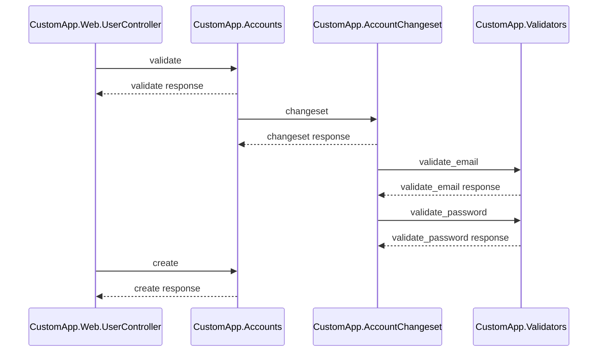

# PipeTrace

[](https://opensource.org/licenses/MIT)
[](https://elixir-lang.org/)

**PipeTrace** is an Elixir library that analyzes Elixir controller code and generates Mermaid sequence diagrams showing the flow of function calls between different modules.

## 🎯 Features

- **Static Code Analysis**: Extracts function calls from Elixir source files
- **Pipe Operator Support**: Handles complex pipe chains (`|>`)
- **Module Function Detection**: Identifies calls to external modules
- **Mermaid Diagram Generation**: Creates sequence diagrams in Mermaid format
- **Comprehensive Testing**: Full test coverage with 18 unit tests

## 🚀 Quick Start

### Installation

Add `pipe_trace` to your list of dependencies in `mix.exs`:

```elixir
def deps do
  [
    {:pipe_trace, "~> 0.1.0"}
  ]
end
```

### Usage

```elixir
# Generate a sequence diagram from a controller function
PipeTrace.generate_diagram("path/to/controller.ex", :action_name)
```

### Example

Given a controller like this:

```elixir
defmodule MyAppWeb.UserController do
  def create(conn, params) do
    params
    |> MyApp.Accounts.normalize()
    |> MyApp.Accounts.create_user()
  end
end
```

PipeTrace will generate a Mermaid sequence diagram:



## 📁 Project Structure

```
lib/
├── mermaid.ex          # Mermaid diagram generation
├── trace.ex            # Static code analysis
└── sequence_mapper.ex  # Main interface
```

## 🧪 Testing

Run the test suite:

```bash
mix test
```

The project includes comprehensive tests covering:
- Function call extraction from various Elixir constructs
- Mermaid diagram generation with different scenarios
- Error handling for edge cases
- Pipe operator processing

## 📚 Documentation

All functions are fully documented with `@doc` and `@spec` annotations. Generate documentation with:

```bash
mix docs
```

## 🤝 Contributing

1. Fork the repository
2. Create a feature branch
3. Make your changes
4. Add tests for new functionality
5. Ensure all tests pass
6. Submit a pull request

## 📄 License

This project is licensed under the MIT License - see the [LICENSE](LICENSE) file for details.

## 🔗 Links

- [GitHub Repository](https://github.com/claudionts/pipe_trace)
- [Mermaid Documentation](https://mermaid.js.org/)
- [Elixir Documentation](https://elixir-lang.org/docs.html)

